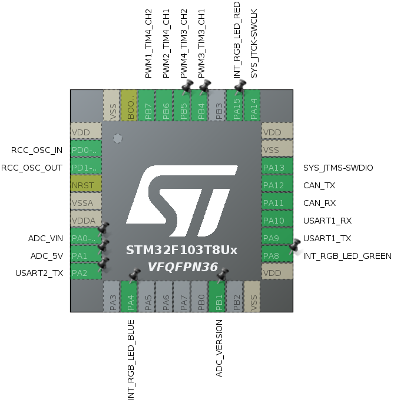
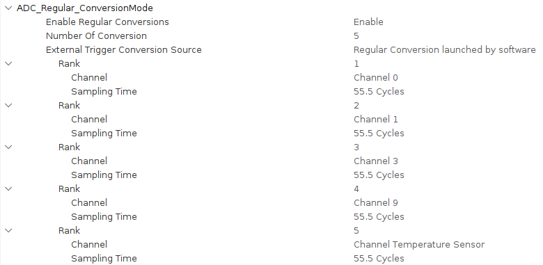

# RaccoonLab Mini v2 node STM32CubeMX generated project

This is a template repository for RaccoonLab Mini v2 node.

The core of this repository is [the .ioc file](project_v2.ioc) that defines the stm32 peripherals with respect to what a real device has.

The peripheral configuration is shown below:

| |
|-|
|  |
|  |

Additionally, the reposity has a source code generated with `STM32CubeMX v6.6.0` using STM32Cube FW_G0 V1.6.1 for `STM32CubeIDE` usage.

Feel free to write your own custom firmware to test some features or suggest something.

The entry point is [Core/Src/main.c](Core/Src/main.c). This file initializes all the peripherals and then goes to application_entry_point(). This is where a custom user logic is expected to be implemented.

## Features

- ADC VIN
- ADC 5V
- ADC Hardware Version
- RGB LED (3 pins)
- UART RX x2
- Independent Watchdog (1.63 sec)

## Reference:

1. Hardware: https://docs.raccoonlab.co/guide/can_pwm/can_pwm_mini_v2.html
2. Docs: https://docs.raccoonlab.co/guide/can_pwm/
3. Usage example: https://github.com/RaccoonlabDev/mini_v2_node
